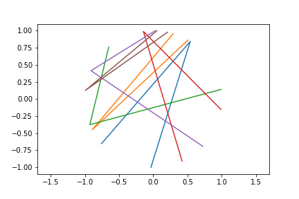
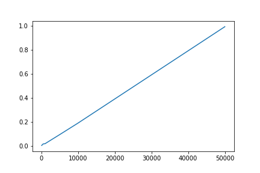

# ForFun
Some cool pet projects. :) 

## 3Point1Semicircle: 
This is an interesting probability problem. 
### Question: 
    Assume 3 points on a circle. What is the probability of all points in one semi-circle?

### Method 1:
We could use some Trigonometry. 3 points on a circle must give a triangle. If the triangle is a Obtuse/Right triangle, then 3 points must be on one semi-circle. 

### Method 2 (generalized to N points):
    Assume N points on a circle. What is the probability of all points in one semi-circle?

1. We could still use Method 1 idea to generalize, but it's not very efficient: N points give 3Cn number of traingles... If all of them are Obtuse/Right triangles. All points must be on one semi-circle.
2. We could think about the relationship between angles we randomly generated: 
    First sort all generated angles ascendingly. Then, all N points must be on the same semi-circle if: 
    1. angle_max - angle_min <= 180, OR
    2. angle_i - angle_i-1 >= 180. 
3. Mathematical reasoning result: Prob(N points on semi-circle) = 

### Results: 
    Number of iterations: 100000
    Number of points: 10
    Correct result: 0.01953125
    Simulated result (Method 2): 0.01989
    Total time took (Method 2): 1.9053 seconds

    Time testing for Method 2:
    Running Method 2 for 100 iterations, took 0.005 seconds.
    Running Method 2 for 500 iterations, took 0.0175 seconds.
    Running Method 2 for 1000 iterations, took 0.0191 seconds.
    Running Method 2 for 5000 iterations, took 0.0948 seconds.
    Running Method 2 for 10000 iterations, took 0.1906 seconds.
    Running Method 2 for 50000 iterations, took 0.9913 seconds.

