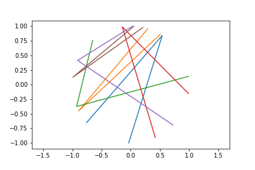

# ForFun
Some cool pet projects. :) 

## 3Point1Semicircle: 
This is a cool probability problem. 
### Question: 
    Assume 3 points on a circle. What is the probability of all points in one semi-circle?
    

### Idea:
3 points on a circle must give a triangle. 
If the triangle is a Obtuse/Right triangle, then 3 points must be on one semi-circle. 

### Generalization idea:
    Assume N points on a circle. What is the probability of all points in one semi-circle?

N points give 3Cn number of traingles... 
If all of them are Obtuse/Right triangles. All points must be on one semi-circle.

